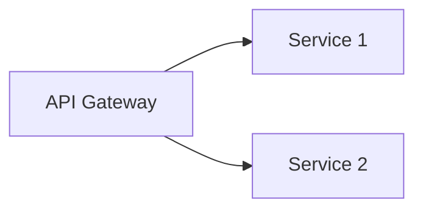

# Marp スライド作成スキル

このスキルは、Marpを使用したスライド作成を効率的にサポートします。

## スキルの機能

1. **スライド構文の参照**: Markdown拡張構文、ディレクティブの使用方法
2. **テンプレート提供**: ビジネス、技術、教育などのプレゼンテーションテンプレート
3. **ビルドコマンド生成**: 適切なMarp CLIコマンドの提案
4. **トラブルシューティング**: よくある問題の解決方法
5. **ベストプラクティス**: 効果的なスライド作成のためのガイダンス

## ドキュメントの場所

詳細なドキュメントは `/home/yodai/marp-workspace/docs/marp/` にあります：

- **README.md**: ドキュメント全体の概要とナビゲーション
- **01_marp_overview.md**: Marpエコシステムの概要
- **02_marp_cli_usage.md**: Marp CLIの詳細な使用方法
- **03_markdown_syntax.md**: Marp固有のMarkdown構文
- **04_directives.md**: ディレクティブシステムの完全ガイド
- **05_theme_development.md**: カスタムテーマの作成方法
- **06_practical_examples.md**: 実践的なサンプルとパターン

## スキル実行時の動作

ユーザーがMarpスライドの作成や編集を依頼した場合：

1. **要件の確認**
   - プレゼンテーションの種類（ビジネス、技術、教育など）
   - 必要な出力形式（HTML、PDF、PPTX）
   - テーマやスタイルの要望

2. **適切なドキュメントの参照**
   - 必要に応じて `/home/yodai/marp-workspace/docs/marp/` から関連ドキュメントを読み取る
   - 構文、ディレクティブ、テーマなどの具体的な情報を提供

3. **スライドの作成/編集**
   - テンプレートを使用または新規作成
   - 適切なディレクティブとMarkdown構文を適用
   - ベストプラクティスに従った構造を維持

4. **ビルドコマンドの提案**
   - 要件に応じた最適なMarp CLIコマンドを生成
   - 開発モード（watch/preview）と本番ビルドの使い分け

## クイックリファレンス

### 基本的なスライド構造

```markdown
---
marp: true
theme: default
paginate: true
---

# タイトルスライド

---

## 内容スライド

- ポイント1
- ポイント2
```

### よく使うディレクティブ

```markdown
<!-- 現在のスライドのみページ番号を非表示 -->
<!-- _paginate: false -->

<!-- 背景画像を右側40%に配置 -->


<!-- スライドを反転色に -->
<!-- class: invert -->

<!-- 見出しをスライド幅に自動調整 -->
# <!--fit--> 大きな見出し
```

### ビルドコマンド

```bash
# プレビューしながら開発
marp -p -w slides.md

# HTML出力
marp slides.md -o output.html

# PDF出力
marp slides.md --pdf -o presentation.pdf

# 複数形式で出力
marp slides.md -o dist/slides.html
marp slides.md --pdf -o dist/slides.pdf
```

## ワークフロー例

### 新しいスライドを作成する場合

1. プレゼンテーションの種類に応じたテンプレートを選択
2. `docs/marp/06_practical_examples.md` から適切な例を参照
3. 必要に応じて `docs/marp/03_markdown_syntax.md` で構文を確認
4. ディレクティブについては `docs/marp/04_directives.md` を参照
5. カスタムテーマが必要な場合は `docs/marp/05_theme_development.md` を確認

### スライドをビルドする場合

1. 開発中: `marp -p -w slides.md` でプレビュー
2. 最終出力: `docs/marp/02_marp_cli_usage.md` で適切なコマンドオプションを確認
3. 複数形式が必要な場合は一括変換スクリプトを使用

### トラブルシューティング

問題が発生した場合：
1. `docs/marp/README.md` の「トラブルシューティング」セクションを確認
2. 各ドキュメントの「トラブルシューティング」セクションを参照
3. 構文エラーの場合は `docs/marp/04_directives.md` の「デバッグのヒント」を確認

## 実践的な使用例

### ビジネスプレゼンテーション

```markdown
---
marp: true
theme: default
paginate: true
header: 'プレゼンテーションタイトル'
footer: '© 2024 Company Name'
---

<!-- _paginate: false -->
<!-- _header: '' -->
<!-- _footer: '' -->
<!-- _class: lead -->

# 四半期業績報告

**営業部門**

2024年1月28日

---

## アジェンダ

1. エグゼクティブサマリー
2. 主要指標
3. 次四半期の戦略

---

## 実績


### 主要なハイライト

- **売上**: 前年比 +15%
- **新規顧客**: 320社
- **顧客満足度**: 4.8/5.0
```

### 技術プレゼンテーション

```markdown
---
marp: true
theme: default
paginate: true
math: katex
---

# システムアーキテクチャ設計

**技術部 | 2024-01-28**

---

## アーキテクチャ概要



---

## コード例

```python
def hello_world():
    print("Hello, Marp!")
```
```

## 重要な注意事項

1. **Front-matterの位置**: 必ずファイルの最初に配置
2. **ディレクティブの構文**: コロンの前後にスペースを入れる `<!-- paginate: true -->`
3. **スライド区切り**: `---`（ハイフン3つ）を使用
4. **画像パス**: 相対パスを推奨
5. **テーマファイル**: `shared/themes/` に配置して再利用

## 詳細情報が必要な場合

特定のトピックについて詳細が必要な場合は、以下のドキュメントを直接参照してください：

- **初めてMarpを使う**: `docs/marp/01_marp_overview.md`
- **CLIコマンドの詳細**: `docs/marp/02_marp_cli_usage.md`
- **Markdown構文**: `docs/marp/03_markdown_syntax.md`
- **ディレクティブ**: `docs/marp/04_directives.md`
- **テーマ開発**: `docs/marp/05_theme_development.md`
- **実践例**: `docs/marp/06_practical_examples.md`

## このスキルの使い方

ユーザーが以下のようなリクエストをした場合、このスキルが自動的に呼び出されます：

- "Marpでスライドを作成して"
- "プレゼンテーションを作りたい"
- "スライドのビルド方法を教えて"
- "Marpのディレクティブについて"
- "/marp" コマンドを実行

明示的にこのスキルを呼び出すには `/marp` と入力してください。
