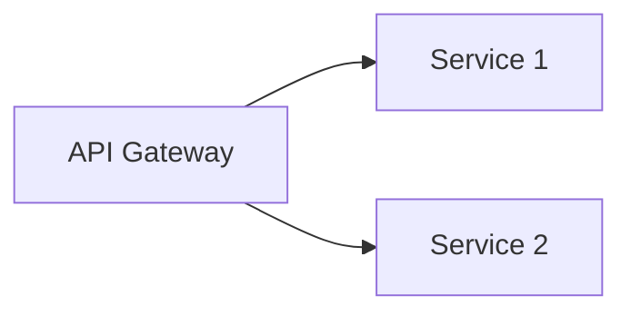

# GitHub Copilot Instructions for Marp Workspace

## Project Overview

This is a Marp (Markdown Presentation Ecosystem) workspace for creating and managing slide presentations from Markdown files.

Website: https://marp.app/

## Agent Skills

**Marp専用スキルが利用可能です！**

このリポジトリには `.github/skills/marp/SKILL.md` にMarp専用のAgent Skillが設定されています。Copilotは自動的にこのスキルを認識し、スライド作成時に必要な専門知識を提供します。

### スキルを有効にする

VS Code設定で以下を有効にしてください：

```json
{
  "chat.useAgentSkills": true
}
```

### スキルの動作

- **自動起動**: スライドやプレゼンテーションに関する質問をすると自動的に起動
- **動的ロード**: 必要な時だけロードされるため、コンテキストウィンドウを効率的に使用
- **包括的サポート**: 構文、ディレクティブ、テーマ、ビルドコマンドなど全てカバー

## Comprehensive Documentation

詳細なMarpドキュメントは `docs/marp/` にあります：

- **`docs/marp/README.md`**: Overview and navigation guide
- **`docs/marp/01_marp_overview.md`**: Marp ecosystem overview
- **`docs/marp/02_marp_cli_usage.md`**: Detailed CLI usage and options
- **`docs/marp/03_markdown_syntax.md`**: Marp-specific Markdown extensions
- **`docs/marp/04_directives.md`**: Complete directives guide (Front-matter, local, spot)
- **`docs/marp/05_theme_development.md`**: Custom theme creation with CSS
- **`docs/marp/06_practical_examples.md`**: Practical templates and examples

**Note**: Agent Skillが有効な場合、これらのドキュメントは必要に応じて動的に参照されます。

## Quick Reference for Copilot

When helping with Marp slides, reference these patterns:

### Basic Slide Structure

```markdown
---
marp: true
theme: default
paginate: true
---

# Title Slide

---

## Content Slide

- Point 1
- Point 2
```

### Common Directives

```markdown
<!-- Current slide only: hide page number -->
<!-- _paginate: false -->

<!-- Background image on right 40% -->


<!-- Invert slide colors -->
<!-- class: invert -->

<!-- Auto-fit heading to slide width -->
# <!--fit--> Large Heading

<!-- Header and footer -->
<!-- header: 'Presentation Title' -->
<!-- footer: '© 2024 Company Name' -->

<!-- Background color -->
<!-- backgroundColor: #f0f0f0 -->
```

### Slide Separator

Use `---` (three hyphens) to separate slides.

### CLI Commands

```bash
# Preview while developing
marp -p -w slides.md

# Convert to HTML
marp slides.md -o output.html

# Convert to PDF
marp slides.md --pdf -o presentation.pdf

# Convert to PowerPoint
marp slides.md --pptx -o presentation.pptx

# Convert all markdown files
marp *.md

# With custom theme
marp slides.md --theme shared/themes/corporate.css
```

## Directory Structure

```
project/
├── decks/                    # Individual presentations
│   ├── meeting-2024/
│   │   ├── slides.md
│   │   └── images/
│   └── workshop/
│       └── slides.md
├── shared/                   # Shared resources
│   ├── themes/               # Custom theme CSS files
│   └── assets/               # Shared images/logos
├── docs/                     # Documentation
│   └── marp/                 # Comprehensive Marp docs
└── dist/                     # Build output
```

## Templates for Code Generation

### Business Presentation Template

```markdown
---
marp: true
theme: default
paginate: true
header: 'Presentation Title'
footer: '© 2024 Company Name'
---

<!-- _paginate: false -->
<!-- _header: '' -->
<!-- _footer: '' -->
<!-- _class: lead -->

# Quarterly Report

**Subtitle**

Date

---

## Agenda

1. Executive Summary
2. Key Metrics
3. Next Steps

---

## Content Slide


### Key Points

- **Metric 1**: Value
- **Metric 2**: Value
```

### Technical Presentation Template

```markdown
---
marp: true
theme: default
paginate: true
math: katex
header: 'System Architecture'
footer: 'Tech Team | Internal'
---

<!-- _paginate: false -->
<!-- _class: invert -->

# Microservices Architecture

**New Platform Design**

Tech Team | 2024

---

## Architecture Overview



---

## Code Example

```python
def example():
    print("Hello, Marp!")
```
```

### Educational Presentation Template

```markdown
---
marp: true
theme: default
paginate: true
math: katex
---

<!-- _class: lead -->

# Python Programming

**Beginner Course - Day 1**

Instructor Name

---

## Today's Agenda

1. Introduction
2. Setup
3. Basic Syntax
4. Exercises

---

## First Program

```python
print("Hello, World!")
```
```

## Best Practices for Code Suggestions

When generating Marp slides:

1. **Always include Front-matter**: Place YAML configuration at the very beginning
2. **Use proper directive syntax**: `<!-- directiveName: value -->` with space after colon
3. **Slide separators**: Use exactly `---` (three hyphens)
4. **Relative paths for images**: Prefer `./images/file.jpg` over absolute paths
5. **Consistent structure**: One presentation per directory
6. **Theme organization**: Place custom themes in `shared/themes/`

## Directive Types

Understand the three types of directives:

1. **Global** (Front-matter): Applies to entire deck
   ```markdown
   ---
   marp: true
   theme: default
   ---
   ```

2. **Local** (HTML comment): Applies to current and subsequent slides
   ```markdown
   <!-- paginate: true -->
   ```

3. **Spot** (underscore prefix): Applies to current slide only
   ```markdown
   <!-- _paginate: false -->
   ```

## Common Patterns

### Title Slide (no header/footer/page number)

```markdown
---
marp: true
paginate: true
header: 'Presentation Title'
footer: 'Footer Text'
---

<!-- _paginate: false -->
<!-- _header: '' -->
<!-- _footer: '' -->
<!-- _class: lead -->

# Title Slide
```

### Section Divider

```markdown
<!-- _class: invert -->
<!-- _paginate: false -->

# Section Name
```

### Content with Side Image

```markdown


## Topic

- Point 1
- Point 2
- Point 3
```

### Two-Column Layout

```markdown
<div style="display: flex;">
<div style="flex: 1; padding-right: 20px;">

## Left Column

- Point 1
- Point 2

</div>
<div style="flex: 1; padding-left: 20px;">

## Right Column

- Point A
- Point B

</div>
</div>
```

## Image Syntax

```markdown
<!-- Basic image -->


<!-- Background image -->


<!-- Background with size -->


<!-- Background with position -->


<!-- Background with filters -->


<!-- Multiple backgrounds -->


```

## Math Support

Enable with `math: katex` or `math: mathjax` in Front-matter:

```markdown
---
math: katex
---

Inline: $E = mc^2$

Block:
$$
\int_0^\infty e^{-x^2} dx = \frac{\sqrt{\pi}}{2}
$$
```

## Troubleshooting Guide

Common issues and solutions:

1. **Slides not rendering**: Ensure `marp: true` is in Front-matter
2. **Directives not working**: Check syntax - must have space after colon
3. **PDF fails**: Requires Chrome/Edge/Firefox installed
4. **Images missing**: Verify relative paths are correct
5. **Theme not applied**: Check theme file path and `@theme` directive in CSS

## File Organization

When creating presentations:

1. Create directory: `decks/presentation-name/`
2. Create slides: `decks/presentation-name/slides.md`
3. Add images: `decks/presentation-name/images/`
4. Keep self-contained for portability

## Build Workflow

Development:
```bash
marp -p -w slides.md
```

Production:
```bash
# HTML
marp slides.md -o dist/slides.html

# PDF
marp slides.md --pdf -o dist/slides.pdf

# PPTX
marp slides.md --pptx -o dist/slides.pptx
```

## Theme CSS Structure

Custom themes go in `shared/themes/`:

```css
/**
 * @theme theme-name
 * @author Your Name
 * @size 16:9 1280px 720px
 */

section {
  width: 1280px;
  height: 720px;
  padding: 70px;
  font-family: 'Arial', sans-serif;
  background-color: white;
  color: black;
}

h1 {
  font-size: 60px;
  color: #1a1a1a;
}

/* Invert class */
section.invert {
  background-color: #1a1a1a;
  color: #ffffff;
}

/* Lead class */
section.lead {
  display: flex;
  justify-content: center;
  align-items: center;
  text-align: center;
}
```

## Reference Documentation

For detailed information on specific topics:

- **CLI options**: See `docs/marp/02_marp_cli_usage.md`
- **Markdown syntax**: See `docs/marp/03_markdown_syntax.md`
- **Directives**: See `docs/marp/04_directives.md`
- **Themes**: See `docs/marp/05_theme_development.md`
- **Examples**: See `docs/marp/06_practical_examples.md`

## Code Generation Guidelines

When Copilot generates Marp slides:

1. Start with proper Front-matter
2. Use descriptive slide titles
3. Keep slides focused (one main idea per slide)
4. Use consistent formatting
5. Include comments for complex directives
6. Suggest appropriate build commands
7. Reference relevant documentation for complex features

## Available Themes

Built-in themes:
- `default` - Clean and professional
- `gaia` - Modern and visually striking
- `uncover` - Minimal and focused

Custom themes should be placed in `shared/themes/` and referenced with:
```markdown
---
theme: custom-theme-name
---
```

Or via CLI:
```bash
marp slides.md --theme shared/themes/corporate.css
```
