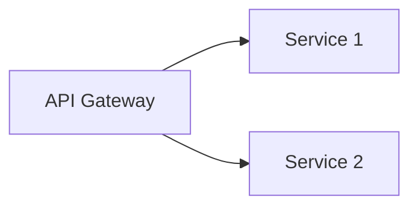

# Marp スライド作成スキル

このスキルは、Marp (Markdown Presentation Ecosystem) を使用したスライド作成を包括的にサポートします。

## いつこのスキルを使うか

以下の場合にこのスキルを使用してください：

- ユーザーがスライドやプレゼンテーションの作成を依頼した時
- Markdownからスライドを生成したい時
- Marp固有の構文やディレクティブについて質問された時
- プレゼンテーションのビルドやエクスポートについて尋ねられた時
- テーマのカスタマイズが必要な時

## 詳細ドキュメントの場所

包括的なMarpドキュメントは `docs/marp/` にあります：

- **README.md**: ドキュメント全体の概要とナビゲーション
- **01_marp_overview.md**: Marpエコシステムの概要と基本概念
- **02_marp_cli_usage.md**: Marp CLIの完全リファレンス（コマンド、オプション、設定）
- **03_markdown_syntax.md**: Marp固有のMarkdown拡張構文
- **04_directives.md**: ディレクティブシステムの完全ガイド（グローバル、ローカル、スポット）
- **05_theme_development.md**: カスタムテーマの作成方法とCSSスタイリング
- **06_practical_examples.md**: 実践的なテンプレートとサンプルコード

**重要**: 詳細な情報が必要な場合は、これらのドキュメントファイルを読み取って正確な情報を提供してください。

## 基本的なスライド構造

すべてのMarpスライドは以下の構造で始めます：

```markdown
---
marp: true
theme: default
paginate: true
---

# タイトルスライド

---

## コンテンツスライド

- ポイント1
- ポイント2
```

### 重要なルール

1. **Front-matter**: ファイルの**最初**に配置する必要があります
2. **スライド区切り**: `---`（ハイフン3つ）を使用
3. **marp: true**: Marp機能を有効にするために必須

## ディレクティブの3つのタイプ

### 1. グローバルディレクティブ（Front-matter）

スライドデッキ全体に適用されます：

```markdown
---
marp: true
theme: default
size: 16:9
math: katex
---
```

### 2. ローカルディレクティブ（HTMLコメント）

現在および以降のスライドに適用されます：

```markdown
<!-- paginate: true -->
<!-- header: 'プレゼンテーションタイトル' -->
<!-- footer: '© 2024 Company' -->
```

### 3. スポットディレクティブ（アンダースコア付き）

現在のスライドのみに適用されます：

```markdown
<!-- _paginate: false -->
<!-- _class: invert -->
<!-- _backgroundColor: #f0f0f0 -->
```

## よく使うディレクティブ一覧

| ディレクティブ | 説明 | 例 |
|--------------|------|-----|
| `paginate` | ページ番号の表示 | `<!-- paginate: true -->` |
| `header` | ヘッダーテキスト | `<!-- header: 'タイトル' -->` |
| `footer` | フッターテキスト | `<!-- footer: '© 2024' -->` |
| `class` | CSSクラス適用 | `<!-- class: invert -->` |
| `backgroundColor` | 背景色 | `<!-- backgroundColor: #fff -->` |
| `color` | テキスト色 | `<!-- color: #333 -->` |

## 画像と背景の構文

### 基本的な画像

```markdown

```

### 背景画像

```markdown
<!-- 全画面背景 -->


<!-- サイズ指定 -->


<!-- 位置指定 -->


<!-- フィルター適用 -->


```

### フィットヘッダー

見出しをスライド幅に自動調整：

```markdown
# <!--fit--> 大きな見出し
```

## Marp CLIコマンド

### 開発モード

```bash
# プレビューウィンドウで開発
marp -p -w slides.md

# サーバーモード
marp -s slides.md
```

### 本番ビルド

```bash
# HTML出力
marp slides.md -o output.html

# PDF出力
marp slides.md --pdf -o presentation.pdf

# PowerPoint出力
marp slides.md --pptx -o presentation.pptx

# 画像出力（全スライド）
marp slides.md --images png

# カスタムテーマ使用
marp slides.md --theme shared/themes/corporate.css
```

### 一括変換

```bash
# ディレクトリ内の全Markdownファイル
marp *.md

# 入力ディレクトリと出力ディレクトリ指定
marp -I ./decks -o ./dist
```

## プレゼンテーションテンプレート

### ビジネスプレゼンテーション

```markdown
---
marp: true
theme: default
paginate: true
header: 'プレゼンテーションタイトル'
footer: '© 2024 Company Name'
---

<!-- _paginate: false -->
<!-- _header: '' -->
<!-- _footer: '' -->
<!-- _class: lead -->

# 四半期報告

**サブタイトル**

2024年1月28日

---

## アジェンダ

1. エグゼクティブサマリー
2. 主要指標
3. 次のステップ

---

## 主要指標


### ハイライト

- **売上**: 前年比 +15%
- **新規顧客**: 320社
- **満足度**: 4.8/5.0
```

### 技術プレゼンテーション

```markdown
---
marp: true
theme: default
paginate: true
math: katex
header: 'システムアーキテクチャ'
footer: 'Tech Team | Internal'
---

<!-- _paginate: false -->
<!-- _class: invert -->

# マイクロサービス
# アーキテクチャ

**新プラットフォーム設計**

技術部 | 2024

---

## アーキテクチャ概要



---

## コード例

```python
def hello_world():
    print("Hello, Marp!")
```
```

### 教育用プレゼンテーション

```markdown
---
marp: true
theme: default
paginate: true
math: katex
---

<!-- _class: lead -->

# Python入門

**初心者向けコース**

講師名

---

## 本日の内容

1. Pythonとは
2. 基本文法
3. 実践演習

---

## 最初のプログラム

```python
print("Hello, World!")
```
```

## よく使うパターン

### タイトルスライド（ヘッダー/フッター/ページ番号なし）

```markdown
<!-- _paginate: false -->
<!-- _header: '' -->
<!-- _footer: '' -->
<!-- _class: lead -->

# タイトル
```

### セクション区切り

```markdown
<!-- _class: invert -->
<!-- _paginate: false -->

# セクション名
```

### コンテンツと画像を並べる

```markdown


## トピック

- ポイント1
- ポイント2
- ポイント3
```

### 2カラムレイアウト

```markdown
<div style="display: flex;">
<div style="flex: 1; padding-right: 20px;">

## 左側

- ポイント1
- ポイント2

</div>
<div style="flex: 1; padding-left: 20px;">

## 右側

- ポイントA
- ポイントB

</div>
</div>
```

## 数式のサポート

Front-matterで有効化：

```markdown
---
math: katex
---

インライン: $E = mc^2$

ブロック:
$$
\int_0^\infty e^{-x^2} dx = \frac{\sqrt{\pi}}{2}
$$
```

## テーマのカスタマイズ

カスタムテーマは `shared/themes/` に配置します：

```css
/**
 * @theme my-theme
 * @author Your Name
 * @size 16:9 1280px 720px
 */

section {
  width: 1280px;
  height: 720px;
  padding: 70px;
  background-color: white;
  color: black;
}

h1 {
  font-size: 60px;
  color: #1a1a1a;
}

section.invert {
  background-color: #1a1a1a;
  color: #ffffff;
}
```

使用方法：

```markdown
---
theme: my-theme
---
```

または：

```bash
marp slides.md --theme shared/themes/my-theme.css
```

## ディレクトリ構造

推奨されるプロジェクト構造：

```
project/
├── decks/              # 各プレゼンテーション
│   ├── meeting-2024/
│   │   ├── slides.md
│   │   └── images/
│   └── workshop/
│       └── slides.md
├── shared/             # 共有リソース
│   ├── themes/         # カスタムテーマCSS
│   └── assets/         # 共有画像・ロゴ
└── dist/               # ビルド出力
```

## トラブルシューティング

### スライドが正しく表示されない

1. `marp: true` がFront-matterにあるか確認
2. Front-matterがファイルの最初にあるか確認
3. ディレクティブの構文を確認（コロンの後にスペース）

### PDF変換が失敗する

```bash
# ブラウザパスを明示的に指定
marp --browser-path /usr/bin/google-chrome slides.md --pdf

# タイムアウトを延長
marp --browser-timeout 120 slides.md --pdf
```

### 画像が表示されない

1. 画像パスが正しいか確認（相対パス推奨）
2. 画像ファイルが存在するか確認
3. 必要に応じて `--allow-local-files` オプションを使用

## ベストプラクティス

1. **Front-matterは最初に**: ファイルの一番最初に配置
2. **相対パスを使用**: 画像やアセットは相対パスで参照
3. **スポットディレクティブを活用**: 特定スライドのみ変更する場合
4. **プレビューしながら開発**: `marp -p -w` で効率的に作業
5. **テーマを再利用**: `shared/themes/` に配置して複数プレゼンテーションで使用

## 詳細情報が必要な場合

特定のトピックについて詳細が必要な場合は、以下のドキュメントを参照してください：

- **CLIオプションの詳細**: `docs/marp/02_marp_cli_usage.md` を読む
- **Markdown構文の完全リファレンス**: `docs/marp/03_markdown_syntax.md` を読む
- **ディレクティブの詳細**: `docs/marp/04_directives.md` を読む
- **テーマ開発ガイド**: `docs/marp/05_theme_development.md` を読む
- **実践的な例とテンプレート**: `docs/marp/06_practical_examples.md` を読む

## 公式テーマ

組み込みテーマ：
- `default` - クリーンでプロフェッショナル
- `gaia` - モダンで視覚的に印象的
- `uncover` - ミニマルで集中力を保つ

## コード生成時の注意事項

スライドを生成する際は：

1. 必ずFront-matterから始める
2. 適切なディレクティブタイプを使用する
3. スライド区切りは必ず `---`（ハイフン3つ）
4. 画像パスは相対パスを推奨
5. ユーザーの要件に応じて適切なテンプレートを選択

## リソースファイル

このスキルディレクトリには追加リソースは含まれていませんが、`docs/marp/` に包括的なドキュメントがあります。必要に応じてこれらのファイルを読み取って、正確で詳細な情報を提供してください。
