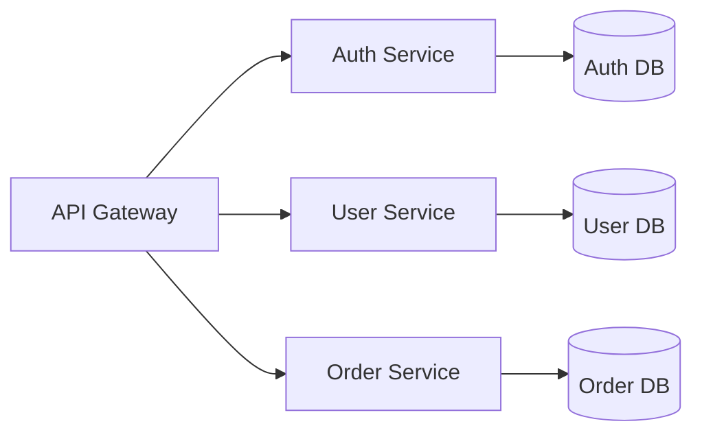

# Practical Examples - コーディングエージェント向けガイド

## 完全なプレゼンテーション例

### 1. ビジネスプレゼンテーション

```markdown
---
marp: true
theme: default
paginate: true
backgroundColor: #ffffff
header: '四半期業績報告'
footer: '© 2024 Company Name | 機密情報'
---

<!-- _paginate: false -->
<!-- _header: '' -->
<!-- _footer: '' -->
<!-- _class: lead -->

# 2024年 Q1 業績報告

**営業部門**

2024年1月28日

---

## アジェンダ

1. エグゼクティブサマリー
2. 売上実績
3. 主要指標分析
4. 競合比較
5. 次四半期の戦略

---

## エグゼクティブサマリー


### 主要なハイライト

- **売上**: 前年比 **+15%**
- **新規顧客**: **320社**
- **顧客満足度**: **4.8/5.0**
- **市場シェア**: **23%** (+2pt)

---

## 売上実績

| 地域 | Q1 2024 | Q1 2023 | 成長率 |
|------|---------|---------|--------|
| 北米 | $5.2M   | $4.5M   | +15.6% |
| 欧州 | $3.8M   | $3.2M   | +18.8% |
| アジア | $4.1M   | $3.6M   | +13.9% |
| **合計** | **$13.1M** | **$11.3M** | **+15.9%** |

---

<!-- _class: invert -->
<!-- _paginate: false -->

# セクション2: 詳細分析

---

## 主要指標の推移

```
売上高（百万ドル）
  15 ┤                                        ●
  14 ┤                                   ●
  13 ┤                              ●
  12 ┤                         ●
  11 ┤                    ●
  10 ┤               ●
     └────────────────────────────────────────
      Q1 23  Q2 23  Q3 23  Q4 23  Q1 24
```

📈 継続的な成長トレンド

---

## 次四半期の戦略

### 重点施策

1. **市場拡大**
   - 新規市場への進出
   - パートナーシップ強化

2. **製品開発**
   - AI機能の実装
   - ユーザー体験の向上

3. **顧客サービス**
   - サポート体制の強化
   - オンボーディング改善

---

<!-- _class: lead -->
<!-- _paginate: false -->

# ご質問・ご意見

**お問い合わせ**: sales@company.com

---

<!-- _header: '' -->
<!-- _footer: '' -->
<!-- _paginate: false -->

# Thank You

**次回報告**: 2024年4月末
```

### 2. 技術プレゼンテーション

```markdown
---
marp: true
theme: default
paginate: true
math: katex
header: 'システムアーキテクチャ設計'
footer: 'Tech Team | 内部資料'
---

<!-- _paginate: false -->
<!-- _class: invert -->

# マイクロサービス
# アーキテクチャ設計

**新プラットフォーム構想**

技術部 | 2024-01-28

---

## アーキテクチャ概要



*マイクロサービス間の通信はREST APIとgRPCを併用*

---

## システム要件

### 機能要件
- ✅ 高可用性（99.99%稼働率）
- ✅ スケーラビリティ（10,000 RPS対応）
- ✅ セキュリティ（ISO 27001準拠）

### 非機能要件
- ⚡ レスポンスタイム < 100ms
- 🔒 データ暗号化（転送時・保管時）
- 📊 リアルタイム監視・ロギング

---

## 技術スタック

<div style="display: flex; justify-content: space-around;">

<div>

### バックエンド
- **言語**: Go, Python
- **フレームワーク**: Gin, FastAPI
- **DB**: PostgreSQL, Redis
- **メッセージング**: RabbitMQ

</div>

<div>

### インフラ
- **コンテナ**: Docker, Kubernetes
- **CI/CD**: GitHub Actions
- **監視**: Prometheus, Grafana
- **ログ**: ELK Stack

</div>

</div>

---

## API設計例

### ユーザー作成エンドポイント

```go
// POST /api/v1/users
type CreateUserRequest struct {
    Email    string `json:"email" binding:"required,email"`
    Password string `json:"password" binding:"required,min=8"`
    Name     string `json:"name" binding:"required"`
}

func (h *UserHandler) CreateUser(c *gin.Context) {
    var req CreateUserRequest
    if err := c.ShouldBindJSON(&req); err != nil {
        c.JSON(400, gin.H{"error": err.Error()})
        return
    }
    // ユーザー作成ロジック
}
```

---

## パフォーマンス最適化

### データベースクエリの最適化

**改善前**:
```sql
SELECT * FROM users WHERE status = 'active';  -- 全カラム取得
```

**改善後**:
```sql
SELECT id, email, name FROM users
WHERE status = 'active'
LIMIT 100;  -- 必要なカラムのみ + 制限
```

⚡ **結果**: クエリ時間が **85%削減** (120ms → 18ms)

---

## セキュリティ対策


### 多層防御アプローチ

1. **ネットワーク層**
   - WAF（Web Application Firewall）
   - DDoS保護

2. **アプリケーション層**
   - JWT認証
   - RBAC（役割ベースアクセス制御）

3. **データ層**
   - AES-256暗号化
   - バックアップ・DR

---

## スケーリング戦略

### 水平スケーリング

```yaml
apiVersion: apps/v1
kind: Deployment
metadata:
  name: user-service
spec:
  replicas: 3
  template:
    spec:
      containers:
      - name: user-service
        image: user-service:v1.0.0
        resources:
          requests:
            cpu: "500m"
            memory: "512Mi"
          limits:
            cpu: "1000m"
            memory: "1Gi"
```

---

## モニタリングダッシュボード

### 主要メトリクス

| メトリクス | 現在値 | 目標 | ステータス |
|-----------|--------|------|-----------|
| 稼働率 | 99.97% | 99.99% | 🟡 |
| レスポンスタイム | 45ms | < 100ms | 🟢 |
| エラー率 | 0.03% | < 0.1% | 🟢 |
| スループット | 8,500 RPS | 10,000 RPS | 🟡 |

---

## コスト分析

### 月次運用コスト

```
インフラコスト構成
━━━━━━━━━━━━━━━━━━━━━━━━━━━━━━
コンピュート  ████████████ 45%  $9,000
ストレージ    ████████     30%  $6,000
ネットワーク  ████         15%  $3,000
その他       ██           10%  $2,000
━━━━━━━━━━━━━━━━━━━━━━━━━━━━━━
合計                            $20,000
```

---

## リスクと緩和策

| リスク | 影響度 | 発生確率 | 緩和策 |
|--------|--------|----------|--------|
| データ損失 | 高 | 低 | 日次バックアップ + DR |
| セキュリティ侵害 | 高 | 中 | 多要素認証 + 監査 |
| パフォーマンス劣化 | 中 | 中 | 自動スケーリング |
| ベンダーロックイン | 中 | 低 | マルチクラウド戦略 |

---

## ロードマップ

### Phase 1: 基盤構築 (Q1 2024) ✅
- インフラセットアップ
- コアサービス開発

### Phase 2: 機能拡張 (Q2 2024) 🔄
- 追加サービス実装
- API Gateway統合

### Phase 3: 最適化 (Q3 2024) 📅
- パフォーマンスチューニング
- セキュリティ強化

---

<!-- _class: lead -->

# Q&A

質問はありますか？

**連絡先**: tech-team@company.com
```

### 3. 教育・トレーニング用プレゼンテーション

```markdown
---
marp: true
theme: default
paginate: true
math: katex
---

<!-- _class: lead -->

# Python プログラミング入門

**初心者向けコース - Day 1**

講師: インストラクター名

---

## 本日のアジェンダ

1. Pythonとは？
2. 開発環境のセットアップ
3. 基本的な文法
4. データ型と変数
5. 演算子と制御構文
6. 実践演習

⏱️ **所要時間**: 約3時間（休憩含む）

---

## Pythonとは？


### 特徴

- 🐍 **読みやすい**: シンプルで明確な構文
- 🚀 **多用途**: Web、AI、データ分析など
- 📚 **豊富なライブラリ**: 70万以上のパッケージ
- 🌍 **大きなコミュニティ**: 世界中で使用

> "Life is short, use Python!"

---

## 開発環境のセットアップ

### 必要なもの

1. **Python本体**
   ```bash
   # インストール確認
   python --version
   ```

2. **コードエディタ**
   - VS Code（推奨）
   - PyCharm
   - Jupyter Notebook

3. **パッケージマネージャー**
   ```bash
   pip install <package-name>
   ```

---

## 最初のプログラム

### Hello, World!

```python
# hello.py
print("Hello, World!")
```

### 実行方法

```bash
python hello.py
```

**出力**:
```
Hello, World!
```

✨ おめでとうございます！最初のPythonプログラムを実行しました！

---

## データ型

### 基本的なデータ型

| 型 | 説明 | 例 |
|----|------|-----|
| `int` | 整数 | `42` |
| `float` | 浮動小数点数 | `3.14` |
| `str` | 文字列 | `"Hello"` |
| `bool` | 真偽値 | `True`, `False` |
| `list` | リスト | `[1, 2, 3]` |
| `dict` | 辞書 | `{"key": "value"}` |

---

## 変数

### 変数の宣言と代入

```python
# 変数の作成
name = "Alice"
age = 25
height = 165.5
is_student = True

# 変数の使用
print(f"名前: {name}")
print(f"年齢: {age}")
print(f"身長: {height}cm")
print(f"学生: {is_student}")
```

**ポイント**: Pythonは動的型付け言語なので、型宣言は不要！

---

## 演算子

### 算術演算子

```python
a = 10
b = 3

print(a + b)   # 13  加算
print(a - b)   # 7   減算
print(a * b)   # 30  乗算
print(a / b)   # 3.333... 除算
print(a // b)  # 3   整数除算
print(a % b)   # 1   剰余
print(a ** b)  # 1000 べき乗
```

---

## 条件分岐

### if文

```python
score = 85

if score >= 90:
    print("優秀！")
elif score >= 70:
    print("良好")
elif score >= 60:
    print("合格")
else:
    print("不合格")
```

**出力**: `良好`

---

## ループ

### forループ

```python
# リストの反復
fruits = ["りんご", "バナナ", "オレンジ"]

for fruit in fruits:
    print(f"好きな果物: {fruit}")
```

### whileループ

```python
count = 1

while count <= 5:
    print(f"カウント: {count}")
    count += 1
```

---

## リスト（配列）

### リストの操作

```python
# リストの作成
numbers = [1, 2, 3, 4, 5]

# 要素の追加
numbers.append(6)         # [1, 2, 3, 4, 5, 6]

# 要素の削除
numbers.remove(3)         # [1, 2, 4, 5, 6]

# 要素へのアクセス
print(numbers[0])         # 1（最初の要素）
print(numbers[-1])        # 6（最後の要素）

# スライス
print(numbers[1:4])       # [2, 4, 5]
```

---

## 演習問題 1

### 問題: FizzBuzz

1から30までの数字を出力してください。ただし：
- 3の倍数の時は「Fizz」
- 5の倍数の時は「Buzz」
- 15の倍数の時は「FizzBuzz」

```python
# ここにコードを書いてください


```

---

## 演習問題 1: 解答例

```python
for i in range(1, 31):
    if i % 15 == 0:
        print("FizzBuzz")
    elif i % 3 == 0:
        print("Fizz")
    elif i % 5 == 0:
        print("Buzz")
    else:
        print(i)
```

**ポイント**:
- 15の倍数のチェックを最初に行う
- `%`演算子で割り切れるかチェック

---

## 演習問題 2

### 問題: リストの合計と平均

次のリストの合計と平均を計算してください：

```python
scores = [85, 92, 78, 90, 88, 76, 95, 89]

# 合計を計算
total = ?

# 平均を計算
average = ?

print(f"合計: {total}")
print(f"平均: {average}")
```

**ヒント**: `sum()` 関数と `len()` 関数を使ってみましょう

---

## 演習問題 2: 解答例

```python
scores = [85, 92, 78, 90, 88, 76, 95, 89]

# 合計を計算
total = sum(scores)

# 平均を計算
average = total / len(scores)

print(f"合計: {total}")      # 693
print(f"平均: {average}")    # 86.625
```

または組み込み関数を使用：

```python
import statistics
average = statistics.mean(scores)
```

---

## まとめ

### 本日学んだこと

✅ Pythonの基礎
✅ 変数とデータ型
✅ 演算子
✅ 条件分岐（if文）
✅ ループ（for, while）
✅ リストの操作

### 次回予告

- 関数の定義
- モジュールとパッケージ
- ファイル操作
- エラー処理

---

<!-- _class: lead -->

# お疲れ様でした！

**次回**: Day 2 - 関数とモジュール
**日時**: 2024年2月1日 10:00-13:00

📧 **質問**: training@example.com
```

## 自動生成のためのテンプレート

### プロジェクト報告テンプレート

```markdown
---
marp: true
theme: default
paginate: true
header: '{{PROJECT_NAME}}'
footer: '{{DATE}} | {{AUTHOR}}'
---

<!-- _paginate: false -->
<!-- _class: lead -->

# {{PROJECT_NAME}}

**{{SUBTITLE}}**

{{AUTHOR}}
{{DATE}}

---

## プロジェクト概要

### 背景
{{BACKGROUND}}

### 目的
{{OBJECTIVES}}

### スコープ
{{SCOPE}}

---

## 現状分析

{{CURRENT_STATUS}}

---

## 課題と解決策

| 課題 | 解決策 | 優先度 |
|------|--------|--------|
{{#ISSUES}}
| {{ISSUE}} | {{SOLUTION}} | {{PRIORITY}} |
{{/ISSUES}}

---

## タイムライン

{{TIMELINE}}

---

## 次のステップ

{{NEXT_STEPS}}

---

<!-- _class: lead -->

# Q&A
```

### 使用例（JSON + テンプレート）

```json
{
  "PROJECT_NAME": "新システム導入プロジェクト",
  "SUBTITLE": "進捗報告",
  "AUTHOR": "プロジェクトマネージャー",
  "DATE": "2024-01-28",
  "BACKGROUND": "既存システムの老朽化により...",
  "OBJECTIVES": "- システムの刷新\n- 業務効率の向上",
  "SCOPE": "営業部門の基幹システム",
  "CURRENT_STATUS": "フェーズ1が完了し、フェーズ2に移行中",
  "ISSUES": [
    {
      "ISSUE": "リソース不足",
      "SOLUTION": "外部ベンダーの活用",
      "PRIORITY": "高"
    },
    {
      "ISSUE": "ユーザートレーニング",
      "SOLUTION": "段階的なロールアウト",
      "PRIORITY": "中"
    }
  ],
  "TIMELINE": "2024年Q1-Q2での完了を目指す",
  "NEXT_STEPS": "1. ユーザーテスト実施\n2. フィードバック収集\n3. 改善実装"
}
```

## コーディングエージェント向けワークフロー例

### Python スクリプトでスライド生成

```python
#!/usr/bin/env python3
import json
from pathlib import Path
from string import Template

def generate_slide(template_file, data_file, output_file):
    """
    テンプレートとデータからスライドを生成
    """
    # テンプレート読み込み
    with open(template_file, 'r', encoding='utf-8') as f:
        template = Template(f.read())

    # データ読み込み
    with open(data_file, 'r', encoding='utf-8') as f:
        data = json.load(f)

    # スライド生成
    slide_content = template.safe_substitute(data)

    # 出力
    with open(output_file, 'w', encoding='utf-8') as f:
        f.write(slide_content)

    print(f"スライドを生成しました: {output_file}")

if __name__ == "__main__":
    generate_slide(
        template_file="templates/project-report.md",
        data_file="data/project-data.json",
        output_file="decks/project-report/slides.md"
    )
```

### 一括変換スクリプト

```bash
#!/bin/bash

# 設定
INPUT_DIR="decks"
OUTPUT_DIR="dist"
THEME="shared/themes/corporate.css"

# ディレクトリ作成
mkdir -p "$OUTPUT_DIR"

# 全てのMarkdownファイルを処理
find "$INPUT_DIR" -name "*.md" | while read -r md_file; do
    # 相対パスを取得
    rel_path="${md_file#$INPUT_DIR/}"
    base_name="${rel_path%.md}"

    echo "Processing: $md_file"

    # HTML生成
    marp "$md_file" \
        --theme "$THEME" \
        -o "$OUTPUT_DIR/$base_name.html"

    # PDF生成
    marp "$md_file" \
        --theme "$THEME" \
        --pdf \
        -o "$OUTPUT_DIR/$base_name.pdf"

    echo "✓ Generated: $base_name"
done

echo "All slides generated successfully!"
```

## ベストプラクティス

### 1. 一貫したディレクトリ構造

```
project/
├── decks/                    # プレゼンテーションソース
│   ├── meeting-2024-01/
│   │   ├── slides.md
│   │   ├── data.json
│   │   └── images/
│   └── workshop/
│       ├── slides.md
│       └── assets/
├── shared/                   # 共有リソース
│   ├── themes/
│   │   ├── corporate.css
│   │   └── technical.css
│   ├── templates/
│   │   ├── project-report.md
│   │   └── technical-presentation.md
│   └── assets/
│       ├── logo.png
│       └── backgrounds/
├── dist/                     # ビルド出力
│   ├── html/
│   └── pdf/
└── scripts/                  # 自動化スクリプト
    ├── generate.py
    └── build-all.sh
```

### 2. バージョン管理

```gitignore
# .gitignore
node_modules/
dist/
*.pdf
*.pptx
.DS_Store
```

### 3. CI/CD統合（GitHub Actions例）

```yaml
# .github/workflows/build-slides.yml
name: Build Slides

on:
  push:
    branches: [main]
    paths:
      - 'decks/**/*.md'

jobs:
  build:
    runs-on: ubuntu-latest
    steps:
      - uses: actions/checkout@v2

      - name: Setup Node.js
        uses: actions/setup-node@v2
        with:
          node-version: '18'

      - name: Install Marp CLI
        run: npm install -g @marp-team/marp-cli

      - name: Build slides
        run: |
          mkdir -p dist
          marp decks/**/*.md -o dist/ --html
          marp decks/**/*.md -o dist/ --pdf

      - name: Upload artifacts
        uses: actions/upload-artifact@v2
        with:
          name: slides
          path: dist/
```

## 参考リソース

- [Marp公式サイト](https://marp.app/)
- [Marp Next Example](https://gist.github.com/yhatt/a7d33a306a87ff634df7bb96aab058b5)
- [Marp Cheat Sheet](https://glennmatlin.doctor/knowledgebase/cheatsheets/marp.html)
- [How Developers Create Slide Decks](https://medium.com/@jamesonbrown/how-developers-create-slide-decks-ef9013aab420)
